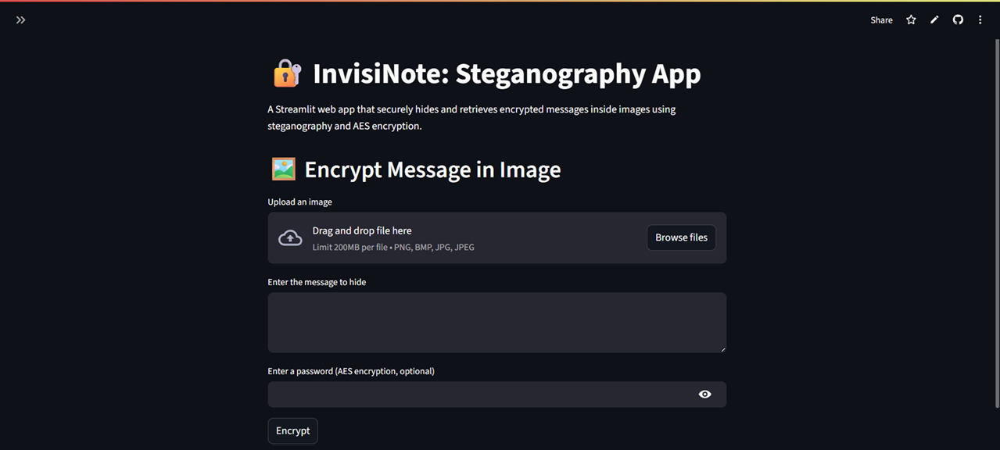
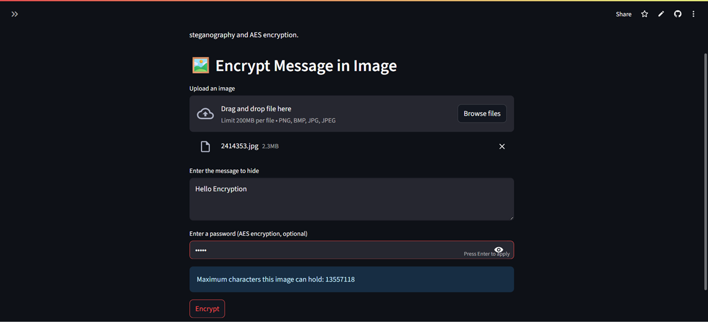
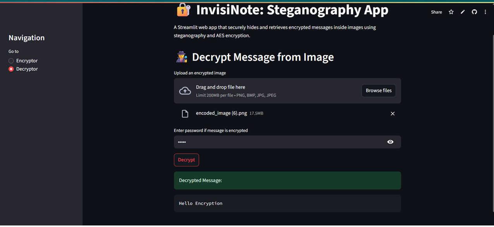

<!DOCTYPE html>
<html lang="en">
<body style="font-family: Arial, sans-serif; line-height: 1.6; padding: 20px;">

  <h1>🔐 Image Steganography Web App using AES Encryption</h1>
  

    A lightweight and secure Streamlit web application that allows users to <strong>hide (encrypt)</strong> and 
    <strong>retrieve (decrypt)</strong> secret messages inside images using 
    <strong>LSB (Least Significant Bit) steganography</strong> and <strong>AES password encryption</strong>.
  

  

    <h2>▶️ Launch App 🚀</h2>
    
Link : https://invisinote.streamlit.app

  

  <h2>🚀 Features</h2>
  <ul>
    <li>📤 Upload an image and embed a message securely inside it.</li>
    <li>🔒 AES encryption support using a password (optional but recommended).</li>
    <li>📥 Download the final image with the hidden message.</li>
    <li>🔓 Decrypt hidden messages from uploaded images.</li>
    <li>⚠️ Detects if no hidden message is present.</li>
    <li>✅ Works with PNG, JPG, JPEG, and BMP formats.</li>
  </ul>

   

    <h2>🖼️ Screenshots</h2>
  <h3>🔹 Encryptor</h3>

<h3>🔹 Encryption Process</h3>

<h3>🔹 Decryptor</h3>

  

  <h2>🧠 How It Works</h2>
  <ol>
    <li><strong>Encryption Page:</strong>
      <ul>
        <li>Upload a cover image.</li>
        <li>Enter a secret message and optionally a password.</li>
        <li>The message is encrypted (if password is given) and hidden in the image using LSB.</li>
        <li>Download the final stego-image.</li>
      </ul>
    </li>
    <li><strong>Decryption Page:</strong>
      <ul>
        <li>Upload the stego-image.</li>
        <li>If a password was used during encryption, enter the same password to reveal the original message.</li>
        <li><strong>If the password is incorrect or missing, the app will display incorrect or garbled output.</strong></li>
        <li>If no message is hidden, a warning like <em>“No hidden message found in the image.”</em> will appear.</li>
      </ul>
    </li>
  </ol>

  <h2>⚙️ System Requirements</h2>
  <ul>
    <li>Python 3.7+</li>
    <li>Compatible OS: Windows, macOS, Linux</li>
    <li>Web browser (Chrome, Firefox, etc.)</li>
  </ul>

  <h2>🧰 Required Libraries</h2>
  
Install all dependencies using:

  <pre><code>pip install -r requirements.txt</code></pre>
  
<strong>requirements.txt:</strong>

  <pre><code>streamlit
pillow
numpy
pycryptodome</code></pre>

  <h2>🔐 Security Note</h2>
  

    If an encrypted image is uploaded to the <strong>Decryptor</strong> without providing the correct password:
    <ul>
      <li>The app will display incorrect or scrambled text.</li>
      <li>This is intentional to protect the confidentiality of the message.</li>
    </ul>
    Always keep your encryption password safe!
  

  <h2>🧪 Run the App Locally</h2>
  <pre><code>streamlit run app.py</code></pre>

   

    <h2>👨‍💻 Developer</h2>
    
Project by Subhadeep Ghosh. 
    For contributions or issues, feel free to contact.

  

  

    <h2>📌 Disclaimer</h2>
    

      This project is developed solely for educational and research purposes.
      It is not intended for production use or to serve as a definitive fact-checking tool.
      The predictions made by the model may not always be accurate, and users are encouraged to verify news from official and reliable sources only.
    

  

</body>
</html>
